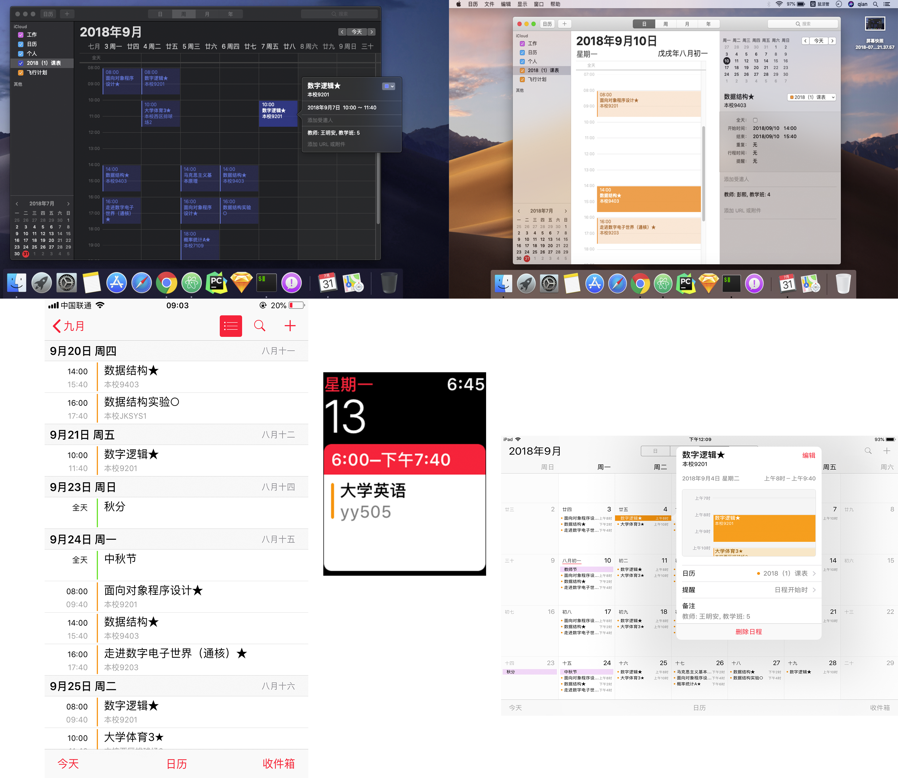

# requests-ccnu

### 脚本简介

本仓库是 CCNUer 日常生活必备的小脚本集合。多是利用 py3 的 requests 库写出的，模拟登录学校网站后，进行您想要的查询和**适度**的爬取。实现很简单，点子更重要，欢迎校友提 PR。

现已完成：

* **[ccnu2ical.py](https://github.com/wwyqianqian/requests-ccnu/blob/master/ccnu2ical.py), [ccnu2ical.js](https://github.com/wwyqianqian/requests-ccnu/blob/master/ccnu2ical.js)**：

  前者通过处理 JSON、后者通过爬取 HTML 结构来获取学生课程表，并按照 RFC 文档把课表改写为```.ics``` 格式的日历文件。同学们可自行导入谷歌日历或 iCloud 等等支持 .ics 格式的系统日历，从此告别每学期一度的手动输入。当前版本号：v0.5.0。

* **[courses.py](https://github.com/wwyqianqian/requests-ccnu/blob/master/courses.py)** ：

  选课脚本，现阶段由于教务处取消了「抢课」环节，故失效，剩余部分代码结构仅供学习参考。

* **[spocDownloader.py](https://github.com/wwyqianqian/requests-ccnu/blob/master/spocDownloader.py)**：

  云课堂下载器。学校新版云课堂前端没有给出「下载」按钮，同学们无法直接下载 PPT、论文等课件，而之前的旧版云课堂有这个功能，很多同学产生了依赖，于是这是个比较大的需求。

  目前此脚本通过模拟登录 spoc 网站，发送请求获取后端数据，拿到了特征，最后通过 URL 拼接，找到了文件真正的下载链接。这个脚本可以爬取到指定课程的所有文件，同学们可以按照个人需求手动下载。当前开发版本号：v0.5.0。

* **[spocFriends.py](https://github.com/wwyqianqian/requests-ccnu/blob/master/spocFriends.py)**：

  学校开放的好友搜索平台。目前支持输入学号范围，批量查询同学姓名。爬取照片由于属于隐私范畴，遂不做。

### 使用方法

#### ccnu2ical.js

登录教务管理系统，打开学生课表查询页面，待网页显示课表后，右键进入审查元素（inspect），在 console 中粘贴```ccnu2ical.js``` 里面的代码。回车后，即可下载到```.ics``` 格式的日历文件。此 js 代码段由友人 [@SumiMakito](https://github.com/SumiMakito) 贡献，十分感谢。

#### ccnu2ical.py

```pip install requests
git clone https://github.com/wwyqianqian/requests-ccnu.git	
```

```
pip install requests
```

```
python3 ccnu2ical.py
```

目前是运行前需要手动输入 cookie，未来计划改写为模拟登录形式。

#### spocDownloader.py

```
git clone https://github.com/wwyqianqian/requests-ccnu.git	
```

```
pip install requests
```

```
python3 spocDownloader.py
```

按照提示，模拟登录需要输入学校云课堂网站真实的学号密码，以及下载页面的部分 url (Site ID) 。

### 效果演示

* 通过 iCloud 帐号同步课表：




* 通过谷歌帐号同步课表：

  

### 友情链接

* [ccnu2ical.js](https://github.com/wwyqianqian/requests-ccnu/blob/master/ccnu2ical.js) 作者 @SumiMakito，我的外校好友，帮忙写了 js 版本的代码：https://github.com/sumimakito
* 数院魏同学写了与 spocDownloader.py 实现相同功能的代码，但是逻辑不同，欢迎围观此仓库：https://github.com/HaHaMaDrid/filedl_from_starC 